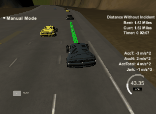

# CarND-Path-Planning-Project
Self-Driving Car Engineer Nanodegree Program
  

## Project Introduction
In this project my goal is to safely navigate around a virtual highway with other traffic that is driving +-10 MPH of the 50 MPH speed limit. There will be provided the car's localization and sensor fusion data, there is also a sparse map list of waypoints around the highway. The car should try to go as close as possible to the 50 MPH speed limit, which means passing slower traffic when possible, note that other cars will try to change lanes too. The car should avoid hitting other cars at all cost as well as driving inside of the marked road lanes at all times, unless going from one lane to another. The car should be able to make one complete loop around the 6946m highway. Since the car is trying to go 50 MPH, it should take a little over 5 minutes to complete 1 loop. Also the car should not experience total acceleration over 10 m/s^2 and jerk that is greater than 10 m/s^3.


## Dependencies
* ubuntu
 	* [Windows](https://www.howtogeek.com/249966/how-to-install-and-use-the-linux-bash-shell-on-windows-10/)
* cmake >= 3.5
  * All OSes: [click here for installation instructions](https://cmake.org/install/)
* make >= 4.1
  * Linux: make is installed by default on most Linux distros
* gcc/g++ >= 5.4
  * Linux: gcc / g++ is installed by default on most Linux distros
* [uWebSockets](https://github.com/uWebSockets/uWebSockets)
	```
	git clone https://github.com/uWebSockets/uWebSockets 
	cd uWebSockets
	git checkout e94b6e1
	mkdir build
	cd build
	cmake ..
	make 
	sudo make install
	cd ../..
	sudo ln -s /usr/lib64/libuWS.so /usr/lib/libuWS.so
	sudo rm -r uWebSockets
	```
* [Term 3 Simulator](https://github.com/udacity/self-driving-car-sim/releases/tag/T3_v1.2)
	* [Windows](https://drive.google.com/open?id=1D8zMmW9VgCaqwCz6-U5NT-boZ0IqKYr-)


## Basic Build Instructions
Once the install for uWebSocketIO is complete, the main program can be built and run by doing the following from the project top directory.
1. Clone this repo.
2. Make a build directory: `mkdir build && cd build`
3. Compile: `cmake .. && make`
4. Run it: `./path_planning`.

<div align=center></div>

## Communication Protocol

Here is the main protocol that main.cpp uses for uWebSocketIO in communicating with the simulator.

**INPUT**: values provided by the simulator to the c++ program

//Main car's localization Data (No Noise)

["x"] The car's x position in map coordinates

["y"] The car's y position in map coordinates

["s"] The car's s position in frenet coordinates

["d"] The car's d position in frenet coordinates

["yaw"] The car's yaw angle in the map

["speed"] The car's speed in MPH


// Previous path data given to the Planner  

//Note: Return the previous list but with processed points removed, can be a nice tool to show how far along the path has processed since last time. 

["previous_path_x"] The previous list of x points previously given to the simulator

["previous_path_y"] The previous list of y points previously given to the simulator


// Previous path's end s and d values 

["end_path_s"] The previous list's last point's frenet s value

["end_path_d"] The previous list's last point's frenet d value


// Sensor Fusion Data, a list of all other car's attributes on the same side of the road. (No Noise)

["sensor_fusion"] A 2d vector of cars and then that car's [car's unique ID, car's x position in map coordinates, car's y position in map coordinates, car's x velocity in m/s, car's y velocity in m/s, car's s position in frenet coordinates, car's d position in frenet coordinates. 


// The map of the highway is in data/highway_map.txt

Each waypoint in the list contains  [x,y,s,dx,dy] values. x and y are the waypoint's map coordinate position, the s value is the distance along the road to get to that waypoint in meters, the dx and dy values define the unit normal vector pointing outward of the highway loop.
The highway's waypoints loop around so the frenet s value, distance along the road, goes from 0 to 6945.554.


**OUTPUT**: values provided by the c++ program to the simulator
The car's  path-planning  in map coordinates

["next_x"] 

["next_y"] 

